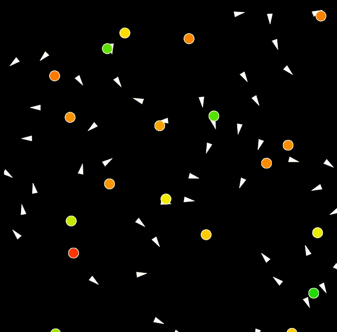

# Boids

A Javascript implementatoin of [Craig Reynolds' Boids algorithm](http://www.red3d.com/cwr/boids/).



The boids are the white arrows. The circles are attractors / detractors. 

## Usage

Just open up `index.html` to see the app running. I've used `browserify` to link the modules together, so to compile the app after making changes, run:

```
browserify main.js -o index.js
```

You'll see that all the parameters are defined in `main.js`. For example, I have them currently set to:

```js
theBoids = new boids(canvas, 50, {
		speed: 3,
		alignmentStrength: 0.8,
		cohesionStrength: 0.1,
		separationStrength: 0.3,
		size: {
			base: 10,
			height: 20
		},
		locals: {
			radius: 50,
			angle: 0.9 * Math.PI
		}
	});
	theObjects = new objects(canvas, 20, {
		shape: {
			radius: 10
		}, 
		maxStrength: 0.1
	})
```